# Kitti360 Semantic Segmentation

The purpose of this project is to experiment with HuggingFace models and create a Semantic Segmentation model based on a large pre-trained backbone.
On top of that, I will try to dive into:
- Ablation studies, when building the model's head
- Quantization, Pruning, and Distillation with the aim of reducing the model size and inference time
- LoRA-tuning for domain adaptation
- Deployment, using the ONNX format and Docker/FastAPI

# Model

## Thought process

After inspecting the [Semantic Segmentation leaderboard on the CityScapes dataset](https://paperswithcode.com/sota/semantic-segmentation-on-cityscapes), which is very representative of the used, Kitti360 dataset too, and taking into consideration what is readily available in the HuggingFace library, I decided to test 3 different types of architectures:

- A pre-trained last-layer fine-tuned [Mask2Former](https://huggingface.co/docs/transformers/en/model_doc/mask2former)
- A pre-trained last-layer fine-tuned [SegFormer](https://huggingface.co/docs/transformers/en/model_doc/segformer)
- A [DinoV2](https://huggingface.co/docs/transformers/en/model_doc/dinov2)-based architecture with a custom head 

I tried some initial training runs, which showed that the first 2 architectures would plateau at around 70% mIoU.
By contrast, the 3rd architecture with a simple linear classifier head provided at least as good results, but also showcased excellent segmentation and attention masks. This left a lot of room to work with, as it basically meant that I only had to work with improving the classifier head. It also was way more interesting and fun to work with.

Thus, I went with the DinoV2 + classifier head architecture, which achieved a 85% validation mIoU, on-par with the best models on the CityScapes leaderboard.

## Architecture 

Semantic segmentation architecture using DINOv2 ViT as a feature extractor with an FPN head that taps 4 transformer layers for multi-scale representation.
Features are projected to 256 channels, fused via convolution, and upsampled from patch-level (14×14) predictions to full resolution using bilinear interpolation.

Or, in simple words: 

1. Extract ViT features using DinoV2 at different scales 
2. Fine-tune the features using Conv2d/BatchNorm/ReLU layers
3. Fuse the extracted features in a bottleneck layer
4. Use an extra Conv2d/BatchNorm/ReLU layer to project the fused features into class predictions
5. Upsample the predictions to the original image size

The size of the final model is the following:

Backbone: 86,580,480 params, 330.28 MB
Head:     3,747,617 params, 14.30 MB
Total:    90,328,097 params, 344.57 MB

## Ablation studies

Ablation studies were performed to gradually decide the optimal architecture for the model's head, the comparison was based on the mIoU of the validation set and indicative results can be seen here:

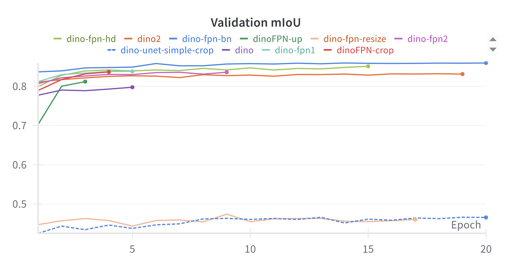

In short, the variations that were tested were the following:

- Augmentation / No Augmentation : Augmentation imrpoved results
- Training on cropped / full images : Full images showed better results, though if not cropped too much, the difference wasn't that big, and one could combine it with patch-inference for similar results
- BatchNorm/GroupNorm/Dropout layers: BatchNorm and GroupNorm showed identical results, and Dropout improved generalization (reduced overfitting). BatchNorm was eventually preferred because it can be quantized easier (Conv2d + BatchNorm + ReLU is a supported sequence for PyTorch's *quantization* module)
- 1 vs 4 DinoV2 hidden states: Using the hidden states from earlier attention layers of DinoV2 improved the mIoU
- Simple linear vs U-Net-like vs FPN-like classifier: The FPN classifier outperformed the rest
- Fusing vs Directly predicting pixel classes: Similar results
- Learnable Upsampling vs Simple BiLinear Interpolation: Interestingly enough, upsampling showed no improvements

## Results

Below, we can see how well the model performs on a simple example image.
Additionally, we can see that the model almost always predicts the main classes that appear the most correctly.

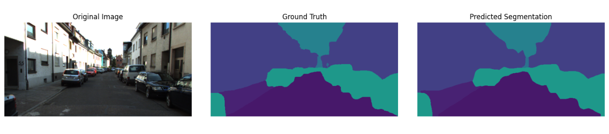
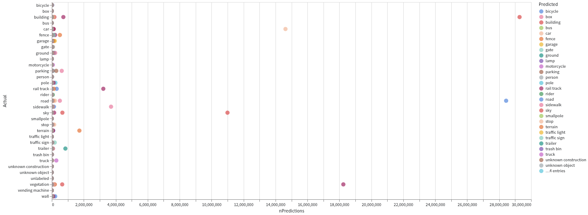

# Quantization

Several different quantization approaches (FP32 -> INT8) were attempted and the results can be seen in the following table:

| Quantization Method         | Size (MB) | Inference (sec)| Power draw (J) | mIoU (%) | Notes |
|---------------------        |-----------|----------------|----------------|----------|-------|
| Baseline (FP32)             |  344.57   |      1.9       | 20/90 GPU/CPU  |    85    | Original model |
| Dynamic Quantization        |  344.57   |      1.4       |      67  CPU   |    79.1  | Weights quantized at runtime |
| Post-Training Quantization  |  108.13   |      1.4       |      67  CPU   |    79.3  | Static quantization with calibration |
| Quantization-Aware Training |  108.13   |      1.4       |      67  CPU   |    84    | Fine-tuned with quantization simulation |

# Pruning

Structured and Unstructured global post-training pruning was attempted and the results were the following:

| Pruning Method | Sparsity (%) | Size (MB) | Inference (sec)| mIoU Drop (%) | mIoU After Fine-tuning (%)| Notes |
|----------------|--------------|-----------|----------------|---------------|---------------------------|-------|
| Baseline       | 0            | 344.57    |      1.9       | -             | -                         | Original model |
| Unstructured   | 15           | 344.57    |      1.9       | 85 -> 80      | -                         | Global magnitude pruning |
| Unstructured   | 30           | 344.57    |      1.9       | 85 -> 26      | 72*                       | Global magnitude pruning |
| Structured     | 30           | 344.57**  |      -         | 85 -> 0       | -                         | Channel pruning |

\* The 72% mIoU was achieved after 7 epochs of training, when the metric and loss reached a plateau.
** When performing 30% / 90% structured pruning and we actually remove the pruned channels, the model size linearly decreases to 242 / 38 MB, which is very significant. However, the model definitely needs to be re-trained.

Conclusions:

- Pruning using PyTorch is pointless, when you don't have the hardware to support it (GPU with tensor cores), as will not reduce inference time.
- PyTorch's structured prunning functions don't actually reduce the model size. They just introduce masks to the model weights and/or biases during the forward pass.
- The biggest problem with pruning, especially when using a huge pretrained network like DinoV2, is that eventually, you will need to retrain it to recover the lost precision. However, that is very expensive and time-consuming. The alternative is to just prune your classifier, which is pointless, since it reflects only around 5% of the total model size/parameters.

# Knowledge Distillation

Response and feature -based knowledge distillation was tried using a student network that is a shallower version of the original one.
Given that the head accounts for only 4% of the total model size, distillation was only aimed towards the backbone.
In short, 9 out of the 12 consecutive ViT layers of the backbone were removed, and the model was re-trained from scratch.

In the response-based distillation, a **temperature-scaled KL divergence loss** was used to transfer soft predictions from the teacher to the student. The student learns to mimic the teacher's class probability distributions rather than just hard labels, allowing it to capture the teacher's uncertainty and inter-class relationships.

For feature-based distillation, an **Attention-based Layer Projection (ALP)** loss was implemented to align intermediate representations between teacher and student networks. Since the teacher has 12 transformer layers while the student has only 3, a learnable attention mechanism was used to determine which teacher layers are most relevant for each student layer. For each student feature map, dot-product attention scores are computed across all 13 teacher feature maps, creating a weighted combination that best matches each student's semantic level/layer. The final loss is the MSE between each student feature and its corresponding attention-weighted teacher feature.

The combined distillation loss integrates three components:
- **Cross-entropy loss** (α=0.5) for ground truth supervision  
- **KL divergence loss** (β=0.25) for response distillation
- **ALP feature loss** (γ=0.25) for intermediate feature alignment

In theory, this multi-level knowledge transfer approach should enable the student to learn both high-level semantic understanding from soft predictions and low-level feature representations from intermediate layers, achieving effective compression while maintaining segmentation quality. The performance of the loss function acroos the 2 runs can be seen in the following pictures.

| Loss Component | Training Progress |
|---------------|-------------------|
| **Overall Training Loss** | **Cross-Entropy Loss** |
| 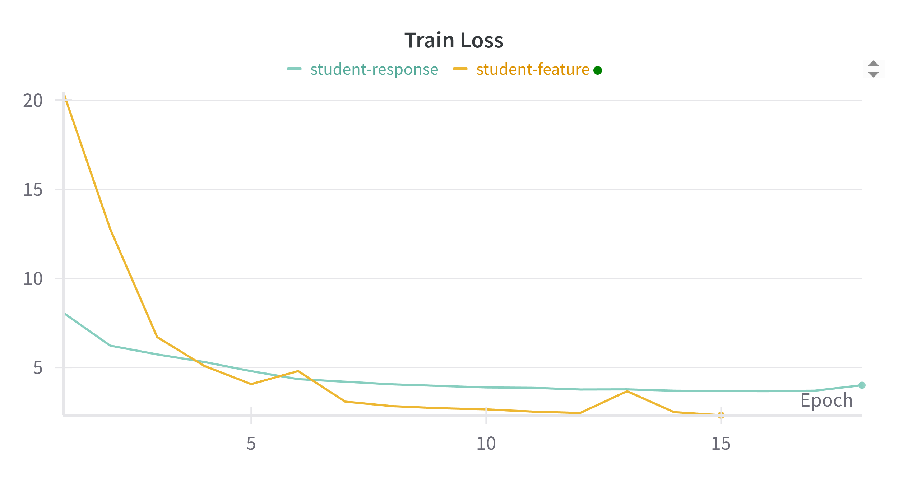 | 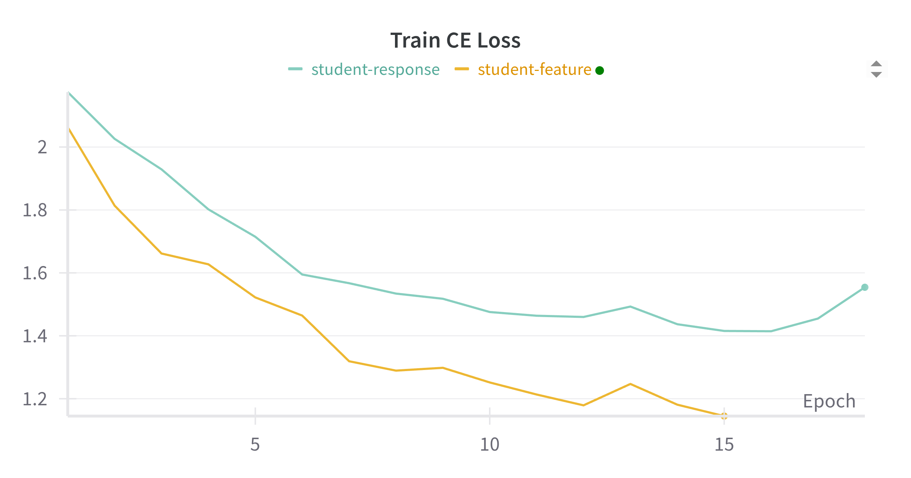 |
| **KL Divergence Loss** | **Attention Layer Projection Loss** |
| 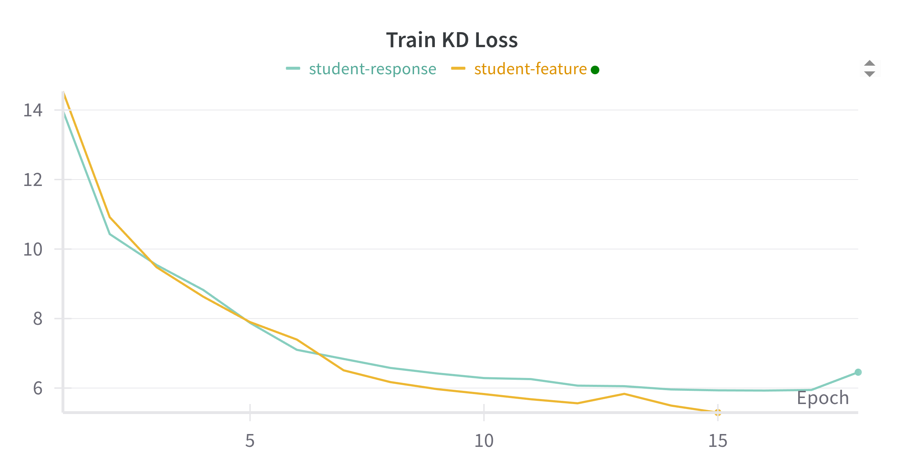 | 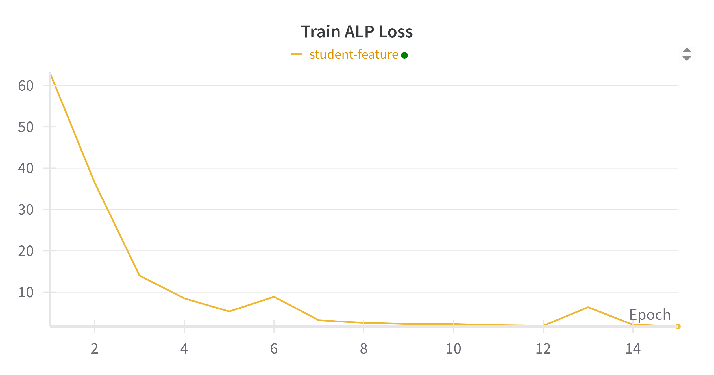 |

Unfortunately but somewhat expectedly, the mIoU performance degraded by roughly 30%, which is a lot.
That said, the training was stopped early and I did not perform hyperparameter tuning, which makes it safe to assume that I could get another 15% in validation mIoU gains.

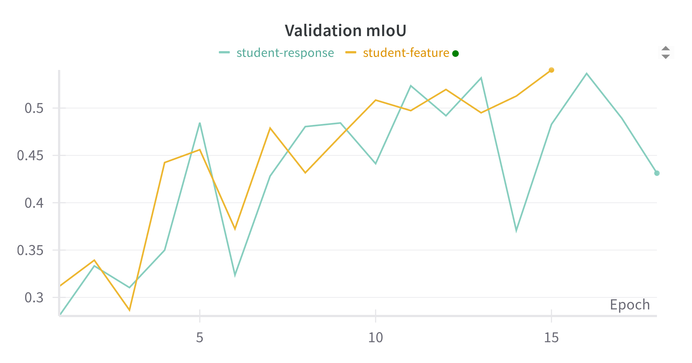

# Fine-tuning | LoRA

To test LoRA-tuning for Domain Adaptation, I used the  maritime segmentation dataset.
I contains ~1300 simply annotated images from a ship's surroundings, which were split into 80/20 train/validation sets.

Given that this new dataset is much simpler than the original one, and that the DinoV2 backbone is already a general-purpose feature extractor, the only fair comparison would be the lora-tuned model (full / head-only) vs the classically (freeze all layers, finetune only the Head / Classifier (last linear layer)) fine-tuned original model.

Using a simple LoRA configuration with rank=8, alpha=32, dropout=0.1, I achieved the following results:

| Method | # Epochs | Time (min) | Val mIoU (%) | Parameters Fine-tuned | % of Total Parameters |
|--------|----------|------------|--------------|-----------------------|-----------------------|
| Head Fine-tuning       | 2  | 7  | 95.77 | 3,740,164 | 4.14  |
| Classifier Fine-tuning | 20 | 60 | 94.75 | 1,028     | 0     |
| LoRA Full Fine-tuning  | 2  | 15 | 94.99 | 719,876   | 0.79  |
| LoRA Head Fine-tuning  | 2  | 7  | 95.31 | 130,052   | 0.14  |

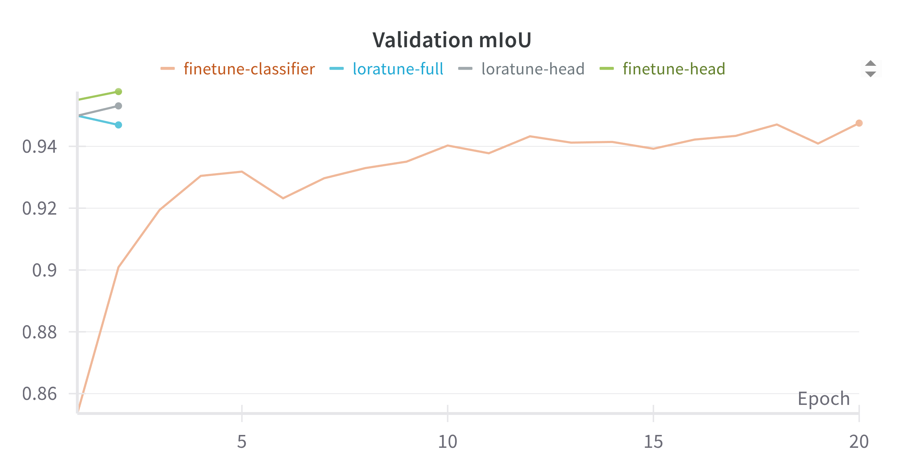

Though probably not to a statistically insignificant extend, it seems that full head fine-tuning might do a little better job at predicting the *unknown* class, compared to lora-tuning. 

| Method | Prediction Result |
|--------|-------------------|
| **Classic Head Fine-tuning** | 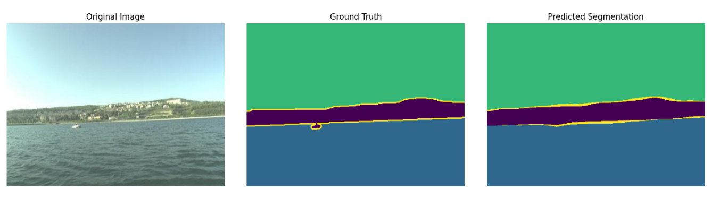 |
| **LoRA Head Fine-tuning** | 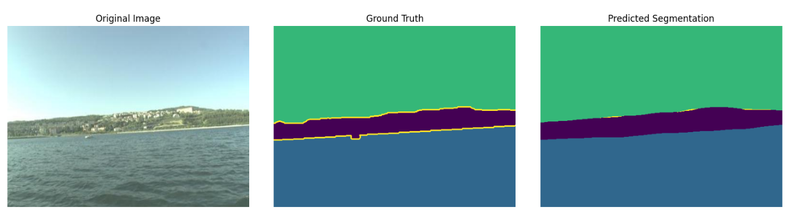 |

In summary, LoRA-tuning achieves an identical or greater validation mIoU in a way shorter time, compared to classical fine-tuning.
It is important to note that the Maritime Dataset is WAY simpler than the original one, so not a lot of fine-tuning was needed either way.
More profound differences are expected with a complicated and different enough Domain Adaptation setting.
On top of that, the DinoV2 features seem to be better off when frozen, probably because the new Dataset is not too "special", compared to the vast dataset the backbone was originally trained upon. 

# Setup

Everything was executed on a **NVIDIA GeForce GTX 1650 Ti Mobile** GPU with 4GB size.
This is an old graphics card with no Tensor Cores.
This means that sparsifying the weight matrices using Pruning will not accelerate inference, as sparse matrix multiplication is not supported.

